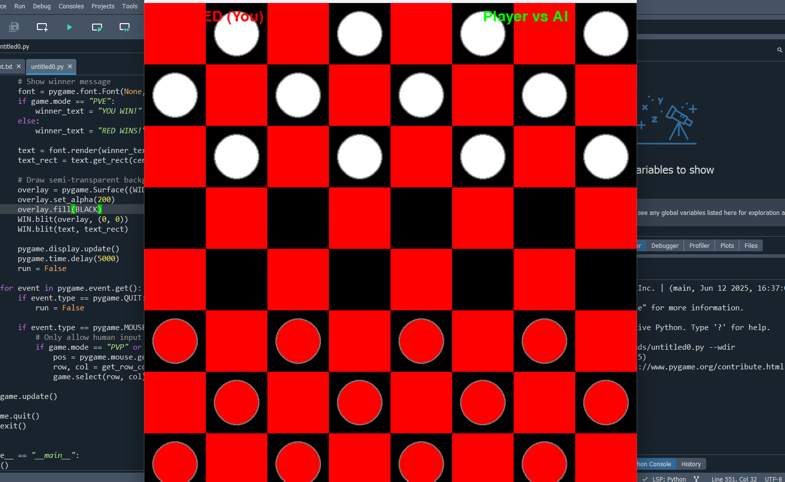

# 🧠 Checkers AI Game (8x8 Board)

A Python-based **Checkers (Draughts)** game with an **AI opponent** using the **Minimax algorithm with Alpha-Beta pruning**. Built with **Pygame** for a clean, responsive graphical interface and interactive gameplay.

---

## 📌 Project Overview

This project implements the classic Checkers game using a **modular architecture** suitable for academic submission and GitHub presentation:

* **`main.py`** — Application entry point.
* **`game_manager.py`** — Manages the game loop, turns, and win conditions.
* **`piece.py`** — Renders the board, pieces, and handles mouse input via Pygame.
* **`checkers_board.py`** — Core game logic, move generation, captures, kings, and AI engine.
* **`constants.py`** — Board size, colors, and configuration constants.

---

## 🎮 Game Modes

* 🆚 **Human vs Human**
* 🤖 **Human vs AI** (Minimax + Alpha-Beta pruning)

---

## 🧠 AI Features

* **Minimax algorithm** with **Alpha-Beta pruning** for performance
* **Adaptive search depth** (deeper in endgame)
* **Move ordering** to prioritize captures and king moves
* **Evaluation function** considers:

  * Piece count (men vs kings)
  * Capture opportunities
  * Board control and mobility
  * Positional advantage

---

## 🕹️ Implemented Rules

* Diagonal movement
* Mandatory captures
* Multiple jumps (chain captures)
* King promotion
* Turn-based play
* Win detection (no legal moves or no pieces)

---

## 🗂️ Folder Structure

```
Checkers_AI/
│
├── main.py                 # Entry point
├── game_manager.py         # Game loop & state management
├── game_ui.py              # Pygame UI & input handling
├── checkers_board.py       # Game logic & AI engine
├── constants.py            # Colors, board size, settings
├── Screenshots/            # Game screenshots
├── README.md               # Project documentation
└── Checkers_AI_Report.pdf  # (Optional) Project report
```

---

## 🚀 How to Run

1. Ensure **Python 3.9+** is installed.
2. Install dependencies:

   ```bash
   pip install pygame
   ```
3. Run the game:

   ```bash
   python main.py
   ```

---

## 📸 Screenshots

### 🏠 Main Menu


### 🎮 Gameplay


### 🏁 End Game


---

## 👨‍💻 Team Members & Contributions

| Name           | Contribution                          |
| -------------- | ------------------------------------- |
| Goda Ahmed Ibrahiem | `checkers_board.py` (AI & Game Logic) `checkers_board.py` |
| Mohamed Hafez | `game_manager.py`          |
| Doaa Ahmed | `main.py`               |
| Zeyad Amer | `piece.py`  |
| Mohamed Khaled | `README.md`  |

---

## 📄 License

This project is developed for **academic and educational purposes only**.

---

## ❤️ Made with Python + Pygame
